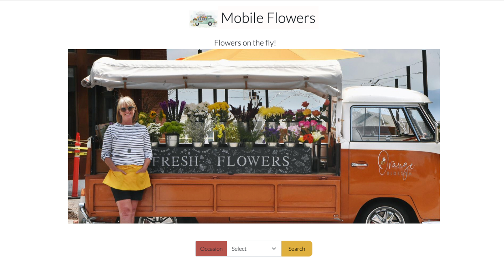

<!--  -->

<h1 align="center">Hi , I'm Sachi</h1>
<h3 align="center">A full stack developer looking to bring my skills to a tech company</h3>

<a href="https://res.cloudinary.com/vanarts-webdev/image/upload/v1681775364/SachiGoto-Resume_szhhah.pdf" target="_blank">My resume</a>

<A href="https://sachigoto.me" target="_blank">My portfolio site</a>

<h1 align="center">Projects</h1>
<table bordercolor="#66b2b2">
    <tr>
            <td width="50%" valign="top">
      <h3 align="center">Sustainable Hub</h3>
         
        
         
        

          
  
  
      

        
<strong>React, TailWind | Node.js | Heroku | Cloudinary | Illustrator</strong>  This app is designed to help people live a more sustainable lifestyle by providing suggestions for sustainable activities in their daily lives. 

    </td>
    <td width="50%" valign="top">
      <h3 align="center">Lost and Found</h3>
       
        <a target="_blank" href="https://flowermobile.sachigoto.me">
<!--            -->
<!--                     -->
          
        </a>
       
        

  
  
      

        
<strong> Angular | Typescript | Bootstrap | MongoDB | Node.js | Cloudinary | </strong>   
This lost and found web app is for reporting lost items. You can upload an image of a found item and edit the item after it’s posted. 
In this app, you can view posts (lost items), submit and edit posts, and deactivate posts once items are claimed.

        </td>

  </tr>
  
  
  
  
  <tr>
    <td width="50%" valign="top">
      <h3 align="center">Willems Berry Farm</h3>
         
        
         
  

          
<!--     -->
 
      

        
<strong>WordPress, Elementor, PHP, MySQL, Illustrator, Figma</strong> - WordPress site for Willems Berry Farm in Abbotsford, BC. Canada. Set up STMP server, ingegrated their social media feeds with their website. 

    </td>
    <td width="50%" valign="top">
      <h3 align="center">Green Around The World</h3>
         
      
         
        

          
  
  
      

        
<strong>Angular | Typescript |MySQL Node.js | Strapi (Headless CMS) | Microservices, Digital Ocean(Cloud hosting)| DevOps</strong>   Full stack web applications. I created client side with Angular, and back end with Node.js and MySQL.

    </td>
  </tr>
  
  
  
  
  
  
  <tr>
    <td width="50%" valign="top">
      <h3 align="center">Mobile Flower</h3>
       
        <a target="_blank" href="https://crapulent-mask.000webhostapp.com/">
<!--            -->
<!--                     -->
          
        </a>
       
        

  
  
      

        
<strong> PHP | MySQL | Bootstrap | Photoshop</strong>   Flowershop website that has a filter feature by four occasions. Items belong to the selected occaion are displayed by calling a stored procedure.

    </td>
    <td width="50%" valign="top">
      <h3 align="center">Sachi Goto Portfolio</h3>
         
        <a target="_blank" href="https://sachigoto.me">
<!--            -->
         
        </a>
         
        

          
  
  
      

        
<strong>Angular, Typescript | GSAP | Strapi(Headless CMS) | Cloudinary | Digital Ocean(Cloud hosting) | Miscroservices | Illustrator</strong>  My majour projects are available through my portfolio site. I created the background with illustrator and animated elements with css keyframes. 

    </td>
  </tr>
  
  
  
  
  
  
  
</table>

- I’m currently learning **React | Three.js**

<h3 align="left">Connect with me:</h3>

<h3 align="left">Languages and Tools:</h3>

                 

